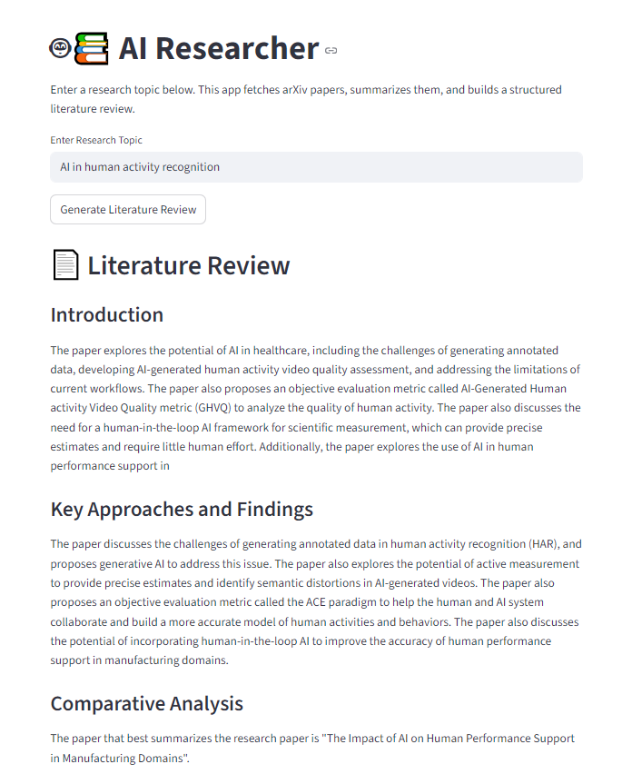
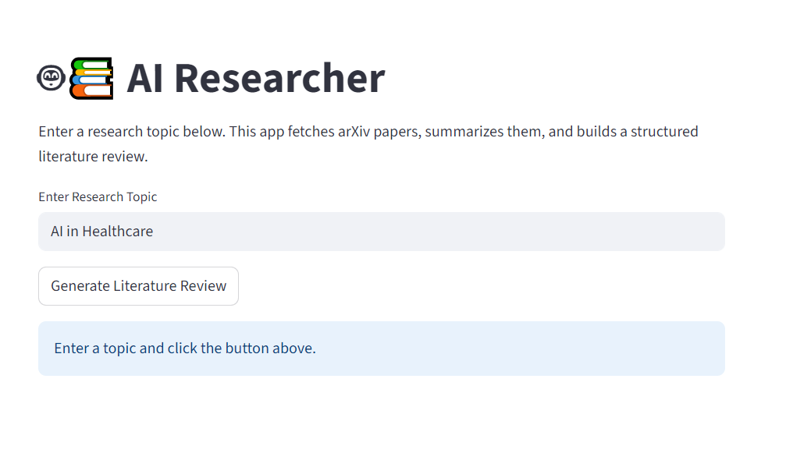

# 🤖📚 AI Researcher – Literature Review Generator

This project generates detailed, structured academic literature reviews from arXiv papers using open-source language models. It fetches abstracts, summarizes them, and writes a full review across multiple academic sections — all powered by Hugging Face models. https://huggingface.co/spaces/gunner2k25/ai-researcher2

## 🚀 Features

- 🔍 **Search arXiv** for relevant papers by topic
- ✂️ **Summarize abstracts** using DistilBART
- 🧠 **Generate detailed literature reviews** using LaMini-Flan-T5
- 📄 Sectioned output: Introduction, Key Findings, Comparative Analysis, Gaps & Future Directions
- 🌐 **FastAPI backend** + 📊 **Streamlit frontend**
- 🧪 Optional notebook interface (Google Colab supported)

---

## 🗂 Project Structure

```
ai-researcher/
├── app.py                # Streamlit frontend (optional)
├── backend.py            # FastAPI backend
├── ai_researcher.ipynb   # Colab notebook (frontend + backend runnable)
├── requirements.txt      # Python dependencies
└── README.md             # This file
```

---

## 🧪 Run in Google Colab

You can use the entire system (backend + frontend) in Google Colab.

📎 [Click here to open the notebook](https://colab.research.google.com/drive/1EK3bzGpZJGuS7T3yuPR19QYc6C-RlPNd?usp=sharing)

---

## 🖥 Local Development

### ▶️ Run the FastAPI Backend

```bash
uvicorn backend:app --reload --host 0.0.0.0 --port 8000
```

### ▶️ Run the Streamlit Frontend

```bash
streamlit run app.py
```

By default, the frontend sends your topic to the FastAPI server and renders the literature review in real time.

---

## 🧠 Models Used

- 🤖 **Summarizer**: `sshleifer/distilbart-cnn-12-6`
- ✍️ **LLM**: `MBZUAI/LaMini-Flan-T5-783M`
- 📚 **Source**: `arxiv` API

---

## 📦 Dependencies

Listed in `requirements.txt`. To install:

```bash
pip install -r requirements.txt
```

Key libraries:

- `fastapi`
- `uvicorn`
- `streamlit`
- `transformers`
- `torch`
- `arxiv`
- `pyngrok` *(for exposing services in Colab)*

---

## 🖼️ Screenshots

### 🔹 1. Streamlit UI Before Input


### 🔹 2. Generated Literature Review Output (Part 1)


### 🔹 3. Generated Literature Review Output (Part 2)


---

## 📘 Example Output

> **Research Topic**: "AI in Healthcare"

**Sections:**
- Introduction
- Key Approaches and Findings
- Comparative Analysis
- Gaps and Future Directions

Includes a formatted **Bibliography** generated from arXiv metadata.

---

## 🛠 Future Work

- [ ] Add paper download (PDFs)
- [ ] Support topic clustering
- [ ] Export review as PDF or LaTeX

---

## 📄 License

MIT License © 2025  
Built by Khalil

---

## 💬 Questions or Issues?

Open an issue on [GitHub](https://github.com/your-mkhalilSEECS/ai-researcher/issues) or contact me directly.
